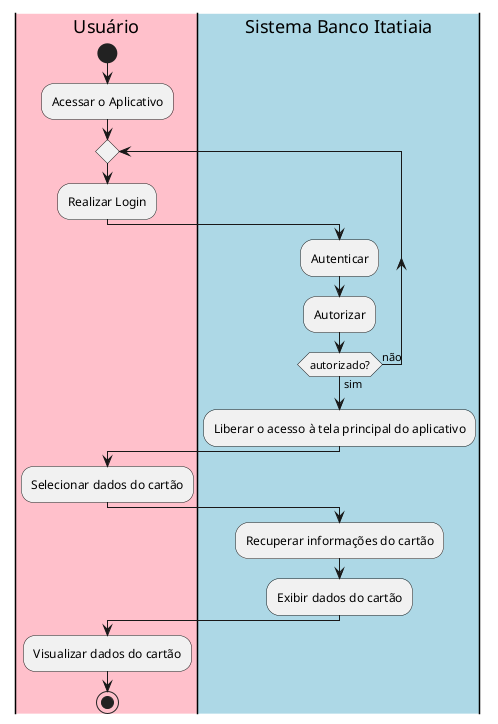

# Caso de Uso

## Acessar sistema bancário
Dona Vilma deseja acessar seu aplicativo bancário.

Para isso, ela abre o aplicativo do Banco Itatiaia em seu celular e realiza o login. O sistema bancário executa os processos de autenticação e autorização da conta. Após a validação bem-sucedida, o sistema libera o acesso à tela principal do aplicativo.

## Realizar uma transferência de dinheiro - Pix
Dona Vilma, após finalizar suas compras no mercado, decide utilizar o Pix como método de pagamento. [Acessando o sistema bancário](#acessar-sistema-bancário), ela navega intuitivamente até a funcionalidade de transferências via Pix. Em seguida, insere as informações necessárias para a transação: a chave Pix do mercado e o valor a ser transferido. 

O sistema do Banco Itatiaia realiza as verificações de segurança e valida as regras de negócio, como a disponibilidade de saldo suficiente na conta e a validade da chave Pix no sistema financeiro brasileiro. Após essas verificações, o sistema apresenta um resumo da transação e solicita a confirmação de Dona Vilma para efetuar o pagamento. Ao confirmar, o Banco Itatiaia realiza a integração com o sistema financeiro do mercado, por meio da infraestrutura do Banco Central, completando a transferência e gerando o comprovante. O colaborador do mercado confirma a transação e se despede educadamente de Dona Vilma.

## Consultar saldo
Dona Vilma deseja consultar o saldo disponível em sua conta. Para isso, ela [acessa o sistema bancário](#acessar-sistema-bancário). Na tela principal do aplicativo, o saldo de Dona Vilma é destacado e exibido. Ela visualiza o valor e fecha o aplicativo.

## Pagamento de contas
Dona Vilma deseja pagar sua conta de internet (um boleto).

Para iniciar o pagamento, ela [acessa o sistema bancário](#acessar-sistema-bancário). Em seguida, seleciona a funcionalidade de pagamento de contas e escolhe escanear o código de barras do boleto ou digitar manualmente o código.

Após essa etapa, o sistema do Banco Itatiaia realiza as verificações de segurança e aplica as regras de negócio, como assegurar que o saldo na conta de Dona Vilma é suficiente e que o código do boleto é válido. Ao concluir essas verificações, o sistema exibe um resumo da operação e solicita a confirmação de Dona Vilma para finalizar o pagamento.

Dona Vilma confirma a operação, e o sistema conclui o pagamento e gera o comprovante da transação.

## Consultar extrato bancário
Dona Vilma recebeu um e-mail de sua operadora de internet informando que o pagamento do mês anterior não havia sido confirmado, embora ela tenha certeza de que já efetuou o pagamento.

Para verificar a situação, ela [acessa o sistema bancário](#acessar-sistema-bancário). Em seguida, Dona Vilma navega até a funcionalidade de extrato bancário e percorre os lançamentos para localizar a movimentação em questão. Durante o processo, o sistema do Banco Itatiaia recupera e exibe o extrato completo de sua conta, conforme registrado nas bases de dados.

Ao encontrar a movimentação desejada, Dona Vilma solicita o comprovante da transação. O sistema gera o documento, que ela prontamente encaminha para sua operadora de internet.

## Consultar fatura do cartão de crédito
Dona Vilma deseja consultar a fatura de seu cartão de crédito para verificar os lançamentos e confirmar o valor total a ser pago no próximo vencimento.

Para isso, ela [acessa o sistema bancário](#acessar-sistema-bancário). Na tela principal, Dona Vilma navega até a aba de “Cartões” e seleciona a opção de consulta de fatura.

O sistema do Banco Itatiaia então recupera as informações da fatura atual do cartão de crédito de Dona Vilma, exibindo uma lista de transações realizadas, o valor total dos lançamentos, e a data de vencimento. Ela analisa os lançamentos. Ao final, Dona Vilma opta por gerar um documento do resumo da fatura.

O sistema gera o resumo da fatura em formato PDF, que Dona Vilma prontamente envia para seu filho realizar o pagamento.

## Consultar dados do cartão
Dona Vilma deseja verificar os dados do seu cartão, incluindo o limite disponível, o limite total, a data de vencimento da fatura, número do cartão, o código de segurança e nome do titular.

Para isso, ela [acessa o sistema bancário](#acessar-sistema-bancário). Na tela principal do aplicativo, Dona Vilma seleciona a opção de “Cartões” e acessa a funcionalidade de consulta de dados do cartão.

O sistema do Banco Itatiaia recupera as informações do cartão e exibe na tela. Dona Vilma visualiza os dados apresentados e fecha o aplicativo.

## Investir dinheiro
Dona Vilma deseja realizar um investimento utilizando o saldo disponível em sua conta bancária.

Para isso, ela [acessa o sistema bancário](#acessar-sistema-bancário). Na tela principal do aplicativo, Dona Vilma seleciona a opção de “Investimentos” e navega até a funcionalidade de realizar um novo investimento.

O sistema do Banco Itatiaia exibe as opções de investimento disponíveis, como CDB, fundos de investimento e poupança. Dona Vilma escolhe o tipo de investimento, insere o valor a ser investido e confirma sua escolha.

O sistema realiza verificações de segurança e valida o saldo em conta. Após essas confirmações, o sistema finaliza a transação de investimento e gera um comprovante de investimento para Dona Vilma.

## Consultar investimentos
Dona Vilma deseja consultar os detalhes de seus investimentos atuais, incluindo saldo, rendimento e informações sobre cada aplicação.

Para isso, ela [acessa o sistema bancário](#acessar-sistema-bancário). Na tela principal do aplicativo, Dona Vilma seleciona a opção de “Investimentos” e escolhe a funcionalidade de consulta de investimentos.

O sistema do Banco Itatiaia recupera e exibe os dados dos investimentos de Dona Vilma, incluindo o saldo total investido, o rendimento acumulado e os detalhes de cada aplicação. Dona Vilma analisa as informações e fecha o aplicativo ao concluir a consulta.

